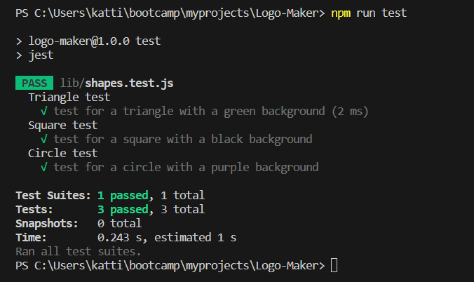

# Logo-Maker

## Description

This project creats a simple svg logo using node.js

## User Story 

AS a freelance web developer

I WANT to generate a simple logo for my projects

SO THAT I don't have to pay a graphic designer

## Acceptance Criteria 

GIVEN a command-line application that accepts user input

WHEN I am prompted for text

THEN I can enter up to three characters

WHEN I am prompted for the text color

THEN I can enter a color keyword (OR a hexadecimal number)

WHEN I am prompted for a shape

THEN I am presented with a list of shapes to choose from: circle, triangle, and square

WHEN I am prompted for the shape's color

THEN I can enter a color keyword (OR a hexadecimal number)

WHEN I have entered input for all the prompts

THEN an SVG file is created named `logo.svg`

AND the output text "Generated logo.svg" is printed in the command line

WHEN I open the `logo.svg` file in a browser

THEN I am shown a 300x200 pixel image that matches the criteria I entered

## Installation

To download all the dependencies user should run npm i

## Usage

Once user installs all the dependencies then they run the code by entering in command line node index. They will be asked a series of questions, after answering them they will see a massage that logo.svg succesfully created.  

## Video-Guide

https://drive.google.com/file/d/1nF7absCHi_rUncLb4q7JmXoVz_tJFPy4/view 

## Test

To run testing, in terminal use the command npm run test.

Tests Succesifully passed:

## Example of generated logo

 
## Credits

Used module 9 & 10 mini project as referance